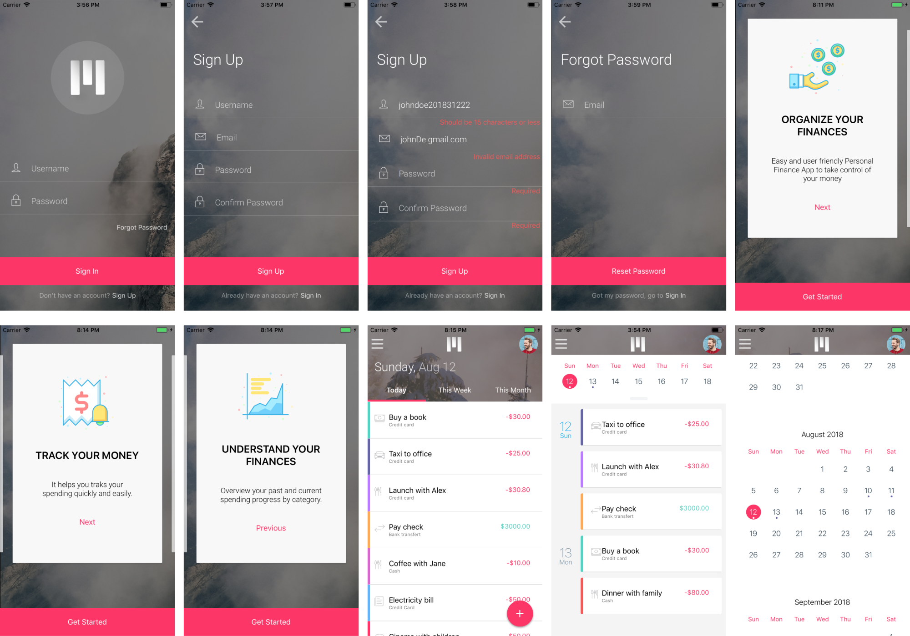
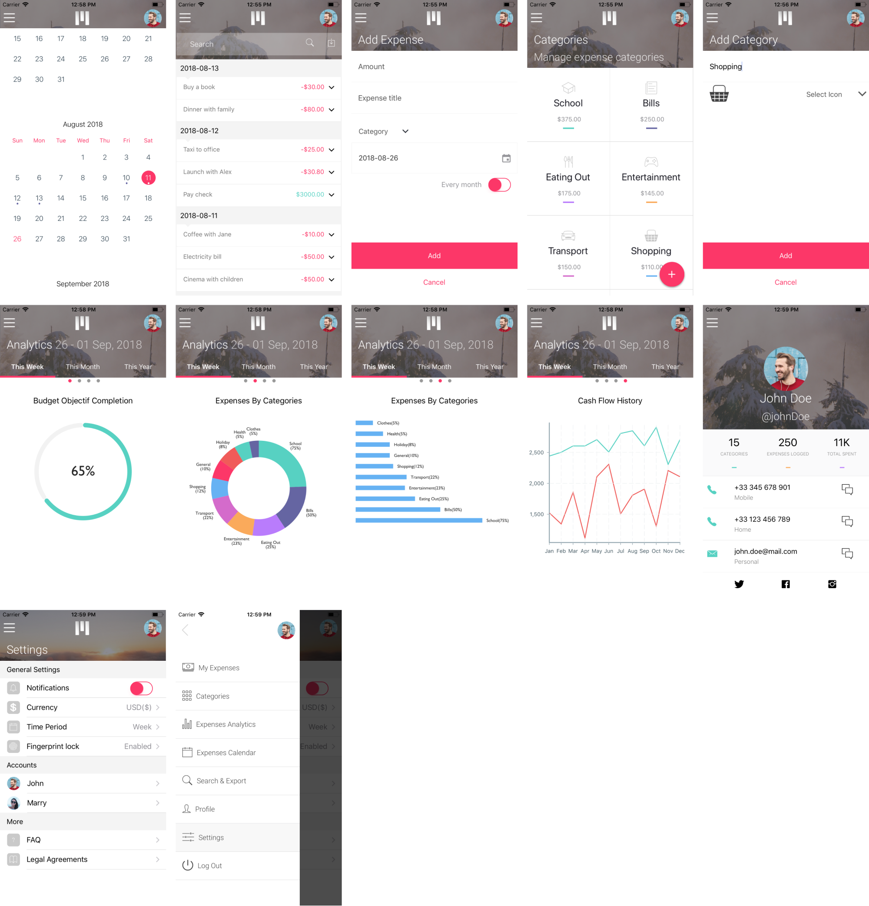

# mMoney : Beautiful Expense Manager App (and well crafted React Native StarterKit)

**mMoney** is a beautiful Expense Manager App to track spending. It' a s simple, intuitive, and user friendly app that help you manage, report and always be aware of what is happening in your own wallet.

This is an expo App with [CRNA](https://facebook.github.io/react-native/blog/2017/03/13/introducing-create-react-native-app), [Native Base](https://nativebase.io/), [React Navigation](https://reactnavigation.org/), [Redux](https://redux.js.org/), [Redux-Thunk](https://github.com/reduxjs/redux-thunk) and with backend interaction using [axiosjs](https://github.com/axios/axios). It combines the best React-Native development practices and pattern to helps you boot a new React Native mobile application and stay productive by providing the development and automation tools needed for the most common tasks.


# Features

* Power-packed with [Redux](https://redux.js.org/), [Redux-Thunk](https://github.com/reduxjs/redux-thunk), [Native Base](https://nativebase.io/) and [React Navigation](https://reactnavigation.org/)
* Integrated with CRNA and Expo
* Full interaction with a Backend API (mock) using [AxiosJs](https://github.com/axios/axios)
* Awesome theme and beautiful screens
* A shared React and React Native structure and code base for both IOS and Android
* Code Linting
* Test and coverage, using [Jest](https://facebook.github.io/jest/)  and [Enzyme](https://github.com/airbnb/enzyme)
* Easy Routing and Navigation using [React Navigation](https://reactnavigation.org/)

# screenshots



Follow the following documentation to install and get started with the development:


## System Requirements

#### NodeJS
* Make sure you have a recent version (8.11 or later) of [node] (https://nodejs.org/en/) installed globally.

#### React Native Developer Tools
* Ensure that [react-native CLI] development tools (https://facebook.github.io/react-native/docs/getting-started.html) and their prerequisites are installed globally.
The instructions are a bit different depending on your operating system (MacOS, Windows, Linux) and the target development environment (Android, OS).
You must follow the guide in the tab labeled [Building Projects with Native Code] (https://facebook.github.io/react-native/docs/getting-started.html). The basic tutorial explaining the main principles of React Native is also very useful for a first start of React Native.

#### Expo
 * Globally installed [Expo](https://expo.io/) : Run `npm install -g expo` in your terminal


## Installation

#### Checkout and Installation

Once the React Native prerequisites are installed on your environment, you can retrieve the application code from the Git repository and install the necessary dependencies.

In the command prompt, run the following commands:

```sh
$ git clone https://gitstrap.com/ExpenseApp/RNExpenseApp.git

$ cd RNExpenseApp

$ yarn (preferred)
or
$ npm install
```

### Launching the application

#### Launch on iOS

* In your terminal, run the folowing command to launch the app in an IOS Emulator:

```sh
$ yarn ios
or
$ npm run ios
```
OR:

* Run the folowing command to launch the app and Scan the QR code in your Expo app:

```sh
$ yarn start
or
$ npm run start
```

#### Launch on Android
* You must open the Android emulator manually or connect your device to USB debug mode.
* In your terminal, run

```sh
$ yarn android
or
$ npm run android
```

OR:

* In your terminal, run the folowing and then Scan the QR code in your Expo app:

```sh
$ yarn start
or
$ npm run start
```


#### Launch the Mock server of the backend API
The default config use [axios-mock-adapter](https://github.com/ctimmerm/axios-mock-adapter) to mock API call. To use the provided API example, follow this steps:

1. **Remove the mock code**

Open the this file `src/utils/api.js` and comment this block:

```javascript
var mock = new MockAdapter(axios, { delayResponse: 50 });

mock.onGet('/auth').reply(200, profileData);
mock.onPost('/auth').reply(200);
mock.onGet('/password').reply(200);
mock.onGet('/expenses').reply(200, expensesData);
mock.onGet('/expenses?q=data&&_page=1&_limit=15').reply(200, expensesData);
mock.onGet('/categories').reply(200, categoriesData);
mock.onPost('/categories').reply(200);
mock.onPost('/expenses').reply(200);
```

2. **Launch the API server**

```sh
$ yarn server
or
$ npm run server
```

3. **Launch the App**